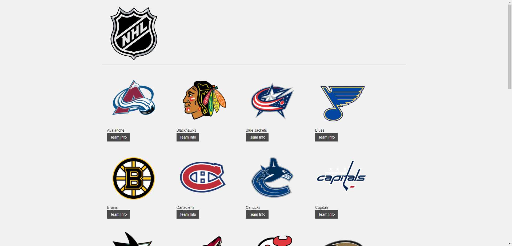
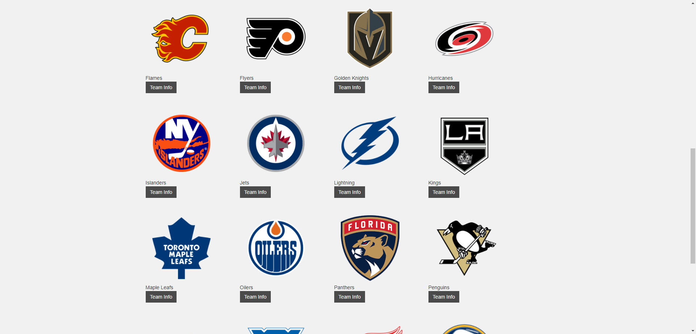
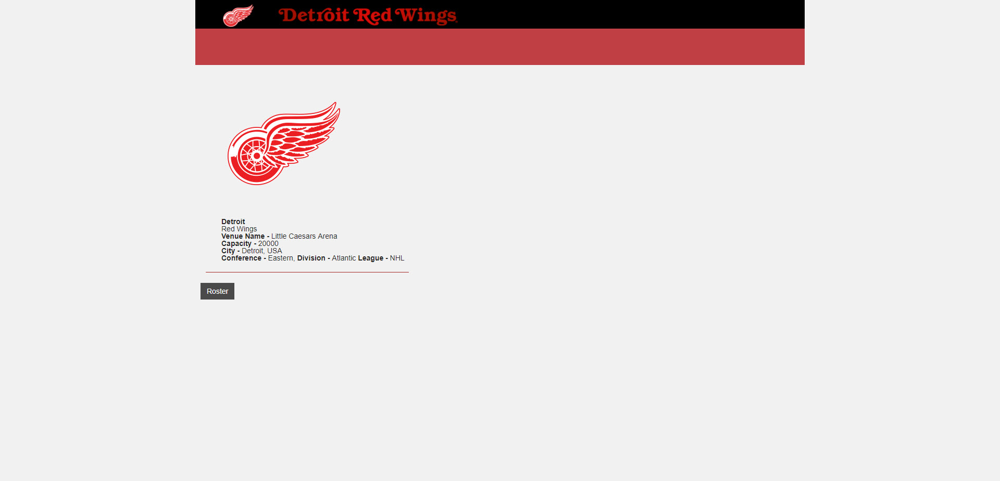
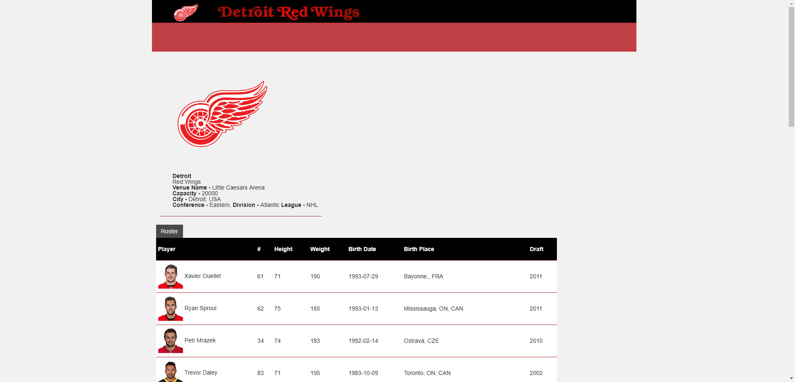
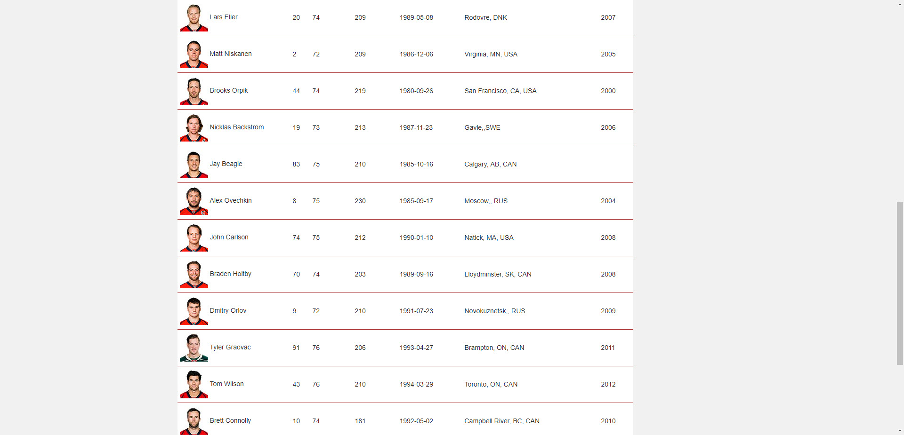

# rest-demo is just simple example project which use:
-SpringBoot, MongoDB, AngularJS, Junit, Mock

-Before run project you need sign up www.sportradar.com and generate nhl key
-pass generated key to application.properties and simply run project and go through localhost:8080/index.html

-Preview

